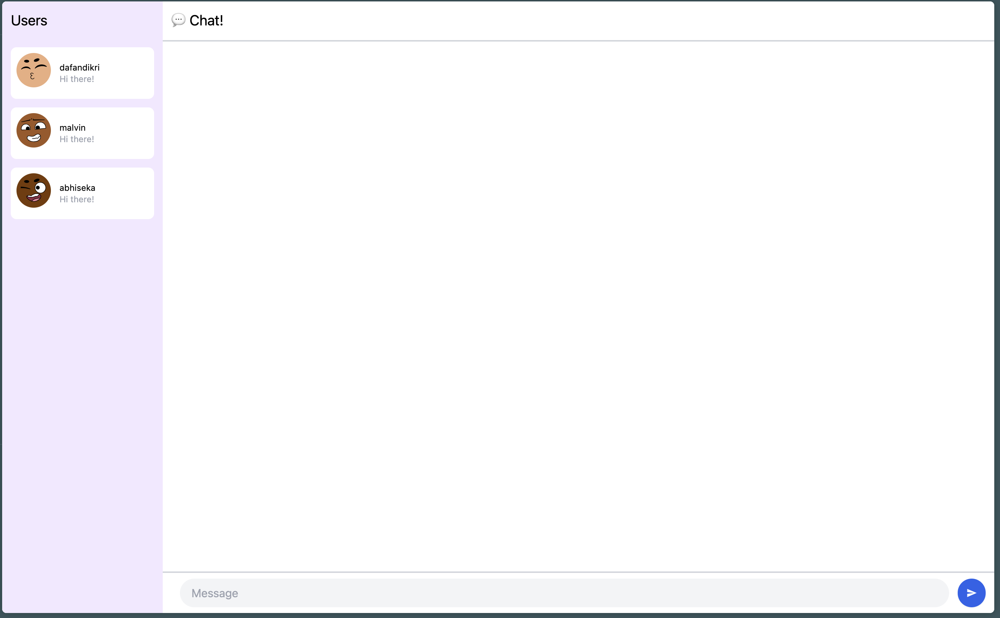

# Module 10 Reflection - YewChat

## Erdafa Andikri - 2306244993, Class A

### 3.1. Original code

### 3.2. Be creative!

In this experiment, I didn’t change much. I only added a random profile picture for each user who enters the chat. This continues and improves upon the outdated API used in the original code. After reading the latest documentation, I updated the API URL accordingly. By using each user’s username as the seed for randomization, every user now gets a random profile picture once they enter the chat page.
